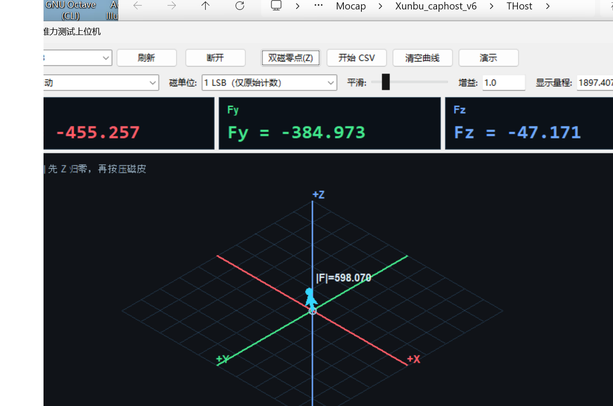

# OSMO Glove Toolkit

Custom firmware variants and Windows host tools for the OSMO/Bowie tactile glove.

This repository brings the complete work together instead of publishing only the
3D force subproject:

- 3D magnetic force firmware and host application
- custom 9-DoF attitude / magnetic-yaw firmware and host application
- official Bosch NDOF single-magnet yaw variant
- full glove-compatible 6-DoF GAMERV build
- calibration, diagnostics, trace recording, replay, and verification tools
- prebuilt HEX/BIN files and SHA256 checksums

> Upstream project: [jessicayin/osmo_tactile_glove](https://github.com/jessicayin/osmo_tactile_glove).
> The upstream repository currently has no license file. Upstream-derived code,
> vendor firmware, and patches are therefore not relicensed here. See
> [NOTICE.md](NOTICE.md).




## Firmware variants

| Variant | Source | Prebuilt | Purpose |
|---|---|---|---|
| 3D force / Bowie multi-magnet firmware | `firmware/force/BowieGlove` | `firmware/releases/force` | Dual-magnet 3D force pipeline and stability fixes |
| Custom 9-DoF attitude / yaw supervisor | `firmware/attitude/BowieGlove_Attitude` | `firmware/releases/attitude_9dof` | GAMERV + two-magnet yaw handling and magnetic disturbance recovery |
| Official Bosch NDOF single-magnet yaw | vendor firmware header under `firmware/ndof` | `firmware/releases/attitude_ndof` | Official NDOF yaw reference using BMM350 #1 |
| Full compatible 6-DoF GAMERV | Based on `firmware/force/BowieGlove` | `firmware/releases/complete_6dof` | Full 20-link glove compatibility build |
| **Dual-magnet differential (stable)** | `firmware/dualmag_diff/BowieGlove` | `firmware/releases/dualmag_diff_20261009` | Both BMM350 per island streamed (primary on `sid`, secondary on `sid+20`); firmware is a pure data pipe, the differential is computed on the host |

The official NDOF source directory was not present in the local workspace when
this toolkit was assembled. Its prebuilt images and the vendor firmware header
are included; the exact NDOF source/configuration is not claimed as recoverable
until that missing source tree is restored.

## Dual-magnet differential build (2026-10-09)

`firmware/releases/dualmag_diff_20261009` is built from the **known-good fixall base**
(`backup_before_magnet_recovery_20260925`) rather than the magnet-recovery line, which
proved unstable on that board (USB drop / re-init loops).

- Both magnetometers of an island are streamed: primary on `sid`, secondary on `sid + 20`
  via the BHI360 BSX **META** channel (`BHY2_SENSOR_ID_MAG_PASS_META`). No SensorAPI and
  no Soft Pass-Through are used at runtime.
- The firmware stays a **pure data pipe**; the differential is computed on the host.
- Requires a **cold boot** (power cycle) after flashing.

The matching host revision adds timestamp-aligned dual-magnet pairing, Kalman bias drift
compensation (with force-event arming and falling-edge release) and a numeric grid + 3D
surface heat map.

See `firmware/dualmag_diff/README.md` for the two build-level fixes that were essential
(makefile include paths, `objects.list`).

## Host applications

`host/` contains the Windows host tools:

- `3D力测试上位机.pyw` - dual-magnet 3D force display, calibration, plots, CSV.
- `姿态测试上位机.pyw` - 3D attitude, magnetometer diagnostics, yaw supervisor UI.
- `纯数据预览.pyw` - raw decoded MAG/QUAT/META preview.
- `read_osmo_glove.py` - COBS/protobuf serial decoder.
- `trace_recorder.py` and replay tools - raw capture, replay, and verification.
- `serial_trace_reader.py`, `firmware_diagnostics.py`, `firmware_profile.py` - host diagnostics.
- `host/magcal/` - offline magnetometer collect, robust ellipsoid fit, Flash upload, and coverage monitor.
- `host/docs/` - Chinese user guides and replay protocol notes.
- `host/THOST_MANIFEST.md` - provenance and curated file map from the original `THost`.

See [host/README.md](host/README.md) and
[host/docs/使用说明.md](host/docs/使用说明.md).

## Quick start

Install dependencies:

```powershell
python -m pip install -r requirements.txt
```

Run one of the applications:

```powershell
python "host\3D力测试上位机.pyw"
python "host\姿态测试上位机.pyw"
python "host\纯数据预览.pyw"
python "host\magcal\magcal_view.pyw"
```

Or use the Windows launchers:

```text
run_3d_force.bat
run_attitude.bat
run_raw_preview.bat
run_magcal_view.bat
```

## Firmware reproduction

The force-firmware patch is pinned to upstream commit `bfc7328`. The complete
one-command verification is:

```powershell
.\scripts\reproduce_all.ps1
```

This clones upstream, checks out `bfc7328`, applies the force-firmware patch,
repairs the upstream build paths, performs a clean build, and compares the
result with `firmware/releases/force/SHA256SUMS.txt`.

Verified result:

```text
REPRODUCTION_PASS=True
BIN 3476FCAC78B1C88F6B4AB33D474C0181AB600D00F02D6282B0F167B595F58DB9
HEX 89D6359A8F34E61A574F088E0C79FA7FE12AD9B68B232D6B33F8CB3C1C7841AB
```

The custom attitude source is included at
`firmware/attitude/BowieGlove_Attitude`. Its prebuilt release is included with
SHA256 checksums. Reproduction instructions for the force build are complete;
the attitude and NDOF variant build instructions are documented separately in
`firmware/README.md`.

## Upstream contribution

The force-firmware stability fix was submitted to upstream as
[jessicayin/osmo_tactile_glove PR #7](https://github.com/jessicayin/osmo_tactile_glove/pull/7).

## License

The MIT license applies only to original material authored by `MiaomiaoYuHao`.
Upstream-derived firmware, vendor firmware headers, generated protocol files,
and patches are explicitly excluded. See [LICENSE](LICENSE) and
[NOTICE.md](NOTICE.md).