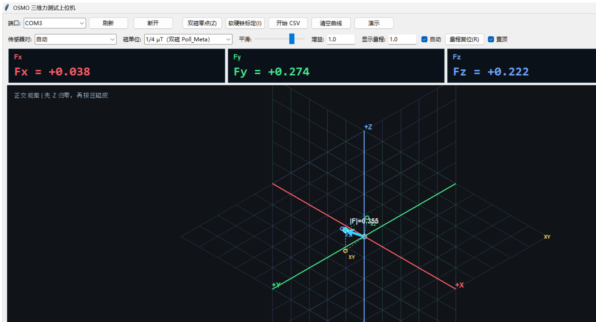
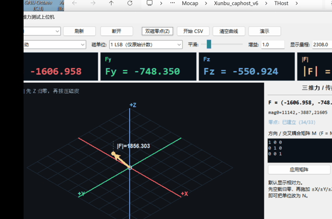

# OSMO Magnet 3D Force

Magnetometer-based 3D force visualization, calibration, and firmware stability
work for the OSMO/Bowie tactile glove.

This repository publishes the original host-side work by
[@lina130](https://github.com/lina130) together with a source patch for the
upstream OSMO/BowieGlove firmware.

> Upstream project: [jessicayin/osmo_tactile_glove](https://github.com/jessicayin/osmo_tactile_glove).
> The upstream repository currently has no license file. The firmware patch
> and generated protocol module are therefore not relicensed here. See
> [NOTICE.md](NOTICE.md).





## Features

- Dual-magnetometer differential force mode.
- Real-time `Fx`, `Fy`, `Fz`, and `|F|` numeric display.
- XY, XZ, and YZ force planes with vector projections.
- Three-axis force history graph with auto-range and reset.
- Dual-magnet median zero capture.
- Hard-iron offset and soft-iron ellipsoid calibration.
- Repeated-rubbing six-direction force-axis calibration.
- Direction-calibration clear/reset action.
- CSV recording and optional trace recording.
- Serial reconnect and connection watchdog.
- Atomic COBS frame transmission to avoid half-written USB frames.
- Firmware recovery for magnetic transients, FIFO overflow, sensor errors,
  BHI360 reset events, and stalled FIFO parsing.

## Repository layout

```text
host/                         Python 3D force application
  utils/bowiepb/              Generated protocol module used by the host
firmware/patches/             Patch for the upstream BowieGlove firmware
docs/assets/                  Screenshots and GIF demo
docs/USER_GUIDE.zh-CN.md      Chinese user guide
requirements.txt
run_3d_force.bat              Windows launcher
```

## Host application quick start

Requirements:

- Windows 10/11
- Python 3.12 recommended
- USB CDC device `2833:B015`

Install dependencies:

```powershell
python -m pip install -r requirements.txt
```

Run the interface:

```powershell
python "host\3D力测试上位机.pyw"
```

Or double-click:

```text
run_3d_force.bat
```

Run the built-in checks:

```powershell
python "host\3D力测试上位机.pyw" --self-test
```

For a complete host test + upstream firmware reconstruction + clean build +
byte-for-byte SHA256 comparison, run:

```powershell
.\scripts\reproduce_all.ps1
```

## Basic operation

1. Connect the Bowie/OSMO USB device.
2. Start the host application and connect to `COMx`.
3. Place the magnetic skin at its resting position.
4. Press `Z` or click `双磁零点`.
5. Apply force and inspect the 3D vector and `Fx/Fy/Fz` values.
6. Use `I` for hard/soft-iron calibration when required.
7. Use the six-direction workflow when the force axes need orientation.
8. Use `R` to reset the auto-range.

See [docs/USER_GUIDE.zh-CN.md](docs/USER_GUIDE.zh-CN.md) for the detailed
Chinese workflow, or [REPRODUCE.md](REPRODUCE.md) for source reconstruction,
build, flash, and SHA256 verification instructions.

Prebuilt release files are included under `firmware/releases/`; they can be
attached to the GitHub Release page when publishing.

## Firmware patch

The patch targets the upstream `firmware/BowieGlove` project at commit
`bfc7328`.

```powershell
git clone https://github.com/jessicayin/osmo_tactile_glove.git
cd osmo_tactile_glove
git checkout bfc7328
git apply C:\path\to\BowieGlove-magnet-stability.patch
```

The patch adds or updates:

- emergency USB servicing from the main loop
- I2C retry and bus recovery
- BHI360 reinitialization after sensor errors, FIFO overflow, or reset
- retry after a failed reinitialization
- zero-progress protection in the BHI360 FIFO parser
- atomic USB CDC frame writes
- independent watchdog support
- stack-size and static-buffer fixes
- firmware stability notes in `FIXES_20260925.md`

Build with STM32CubeIDE or the project's existing GNU Arm Makefile. Do not
commit `Debug/`, `build_*/`, `backup_*/`, `.elf`, `.hex`, `.bin`, `.map`, or
`.list` files to Git. Attach release binaries in GitHub Releases instead.

## Validation status

Host-side automated checks currently pass:

```text
FORCE_SELF_TEST_PASS=True
MATRIX_OK=True
DIFFERENTIAL_OK=True
ZERO_CAPTURE_OK=True
ELLIPSOID_OK=True
RUBBING_AXIS_OK=True
SIX_DIRECTION_FIT_OK=True
THREE_PLANE_GRID_OK=True
VECTOR_PROJECTIONS_OK=True
CANVAS_PROJECTION_OK=True
```

The firmware patch compiles with 0 errors in the local Debug build. The
hardware-in-the-loop strong-magnet regression test still needs to be run on the
physical glove before presenting it as fully validated.

## License

The MIT license in this repository applies only to original material authored
by `lina130`. Upstream-derived files are explicitly excluded. See
[LICENSE](LICENSE) and [NOTICE.md](NOTICE.md).

## Citation

If you use the upstream OSMO project, cite:

```bibtex
@article{yin2025osmo,
  title={OSMO: Open-Source Tactile Glove for Human-to-Robot Skill Transfer},
  author={Jessica Yin and Haozhi Qi and Youngsun Wi and Sayantan Kundu and Mike Lambeta and William Yang and Changhao Wang and Tingfan Wu and Jitendra Malik and Tess Hellebrekers},
  journal={arXiv:2512.08920},
  year={2025}
}
```